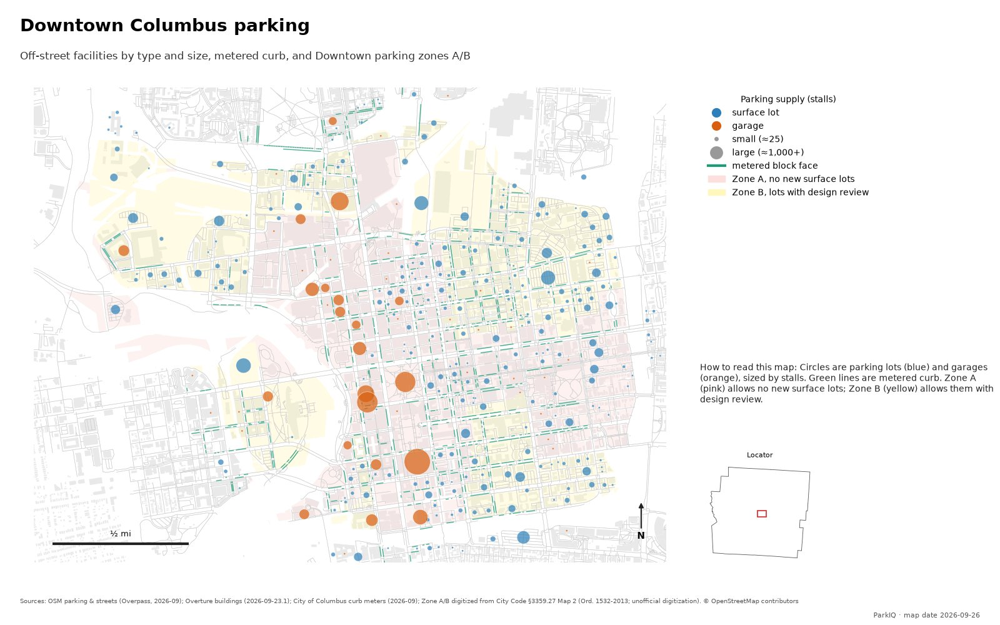

# ParkIQ Franklin County Map Series

Part of **ParkIQ: A Parking Lot Site Selection Location Intelligence Analysis**.

Maps of parking demand, supply and shortage in Franklin County, Ohio, made from the ParkIQ runs.
Published maps appear in the Cartography gallery of the portfolio site.

*Downtown Columbus parking: off-street lots and garages sized by stalls, metered curb, and the
Downtown parking zones A and B (Zone A allows no new surface lots).*

## Map standard

Every map is made with [`parkiq/maps.py`](../../parkiq/maps.py), which adds and checks the same
elements on each one and refuses to save a map that lacks any of them:

* a title, and a subtitle naming the measure, time of week and area
* a legend with units and a one or two sentence "how to read this map" note
* a scale bar, a north arrow, and a locator inset when the map is zoomed in
* sources with vintages, and "© OpenStreetMap contributors" where OpenStreetMap data is used
* "ParkIQ" and the map date; maps of results that can still change add "Analysis as of <month>"
* no parcel identifiers or owner names on anything public

The tests in [`tests/test_maps.py`](../../tests/test_maps.py) fail if a map lacks an element.
