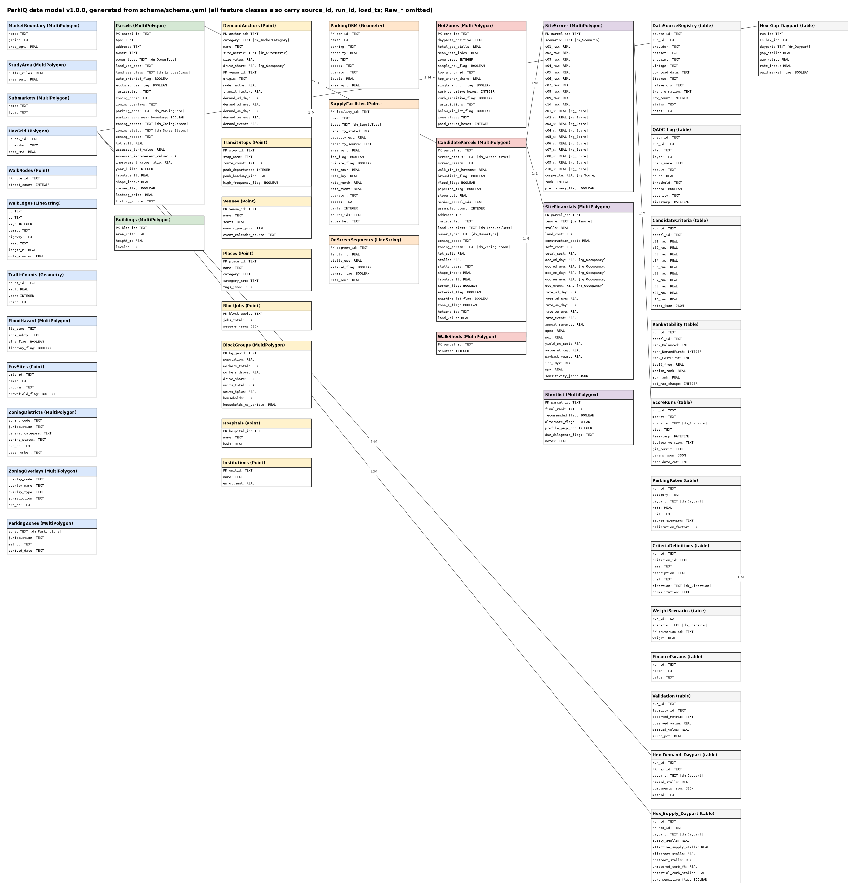
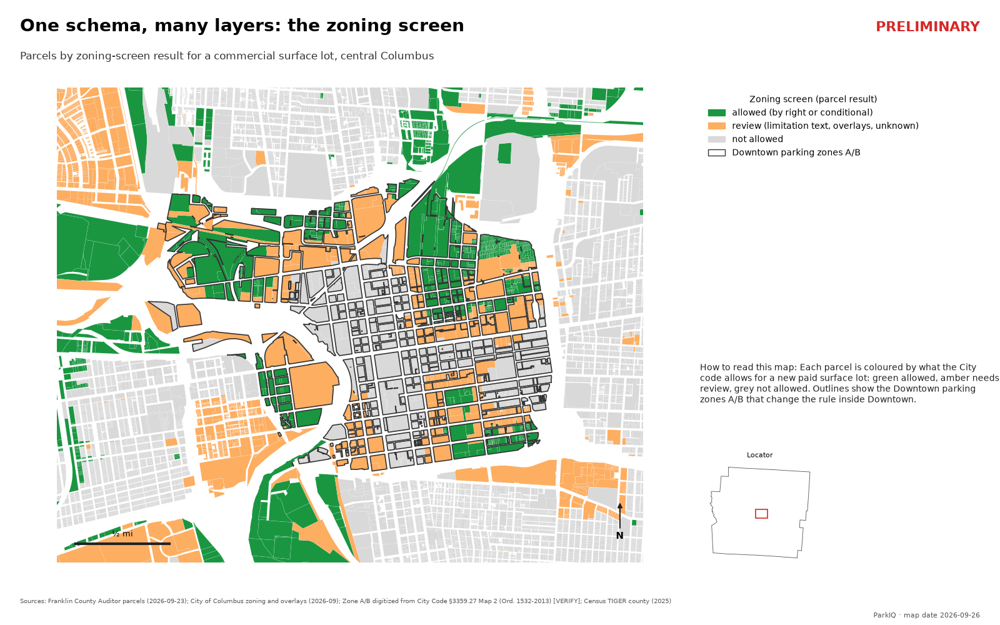

# ParkIQ Parking Data Model

ParkIQ: A Parking Lot Site Selection Location Intelligence Analysis

| | | | |
|---|---|---|---|
| Feature classes | **{{feature_classes}}** | Coded and range domains | **{{domains}}** |
| Attribute tables | **{{tables}}** | Relationship classes | **{{relationships}}** |
| Raw source snapshots | **{{raw_layers}}** | Fields defined | **{{schema_fields}}** |
| Live sources loaded (Franklin County, OH) | **{{sources_loaded}}** | Parcels in the run | **{{parcels}}** |
| QA checks logged | **{{qa_checks}}** | Schema diff, live run vs definition | **{{schema_diff}}** |

*Numbers are generated from run `{{run_id}}` and schema v{{schema_version}} when this report is built; none are typed by hand.*

## The Problem

A parking site-selection model pulls together more than a dozen public datasets (parcels, zoning, jobs, census block groups, transit schedules, flood zones, building footprints, parking lots, meters) and produces many derived layers: a hexagon grid, demand and supply by time of day, hot zones, candidate parcels, scores and pro formas. Without a deliberate data model, that turns into a folder of one-off files where:

- field names, units and allowed values drift between steps, so a join or a filter silently drops records;
- nobody can say which source and vintage a number came from, or which run produced it;
- the design lives in someone's head, so a new market or a new analyst starts from scratch;
- the documentation (ERD, data dictionary) is drawn once by hand and is wrong by the next change.

## My Approach

**One definition file.** Every feature class, table, field, type, domain, subtype and relationship is declared once in `schema/schema.yaml`. The same file drives four things, so they can never disagree:

- **BuildSchema** creates every layer and table, empty, in a new GeoPackage, and writes the domains as GeoPackage schema-extension constraints so GIS software sees them as field domains.
- **Validation on write**: every time a pipeline step writes a layer, the data is coerced and checked against the schema (types, nullability, uniqueness, domain values); a violation stops the run with every problem listed.
- **schema-diff** compares any GeoPackage with the definition and lists every difference: missing layers, wrong geometry or CRS, missing or extra columns, detached domains.
- **Documentation**: the ERD (draw.io and PNG) and the data dictionary are generated from the file; a test fails if the committed documents are out of date.

**One schema for every market.** Markets differ only in their configuration file (boundary, projection, source settings), never in the data model, so a second city reuses the design unchanged.

**Lineage and provenance built in.** Every feature class carries `source_id`, `run_id` and `load_ts`. Each run writes one GeoPackage plus a source registry (endpoint, vintage, download date, licence, native CRS, transformation, row count, status) and a QA log, so any number traces back to a source and a run.

## Technical Highlights

- **Feature datasets mirror the analysis**: Reference (boundary, study area, H3 grid, walk network, zoning, flood, environmental sites), Cadastral (parcels, buildings), Demand (anchors, transit, venues, jobs, block groups), Supply (facilities, metered curb), Analysis (hot zones, candidate parcels, walk sheds) and Results (scores, financials, shortlist).
- **Domains enforce vocabulary**: land-use class, owner type, zoning screen, anchor category, supply type, daypart, screen status, scenario and tenure are coded domains; scores (0–100) and occupancy (0–1) are range domains. The constraints are re-attached after every write, because GDAL drops them when it replaces a table.
- **Subtypes and relationship classes**: parcels are subtyped by land-use class and supply facilities by type; eleven relationship classes (for example candidate parcel → scores, run → scores, hex → demand by daypart) are recorded in the GeoPackage and become real relationship classes in the file-geodatabase export.
- **Hex × time-of-day results as tables**: demand, supply and gap per hex and daypart are attribute tables keyed by the H3 cell id and joined to the {{hexes}}-cell grid for mapping, instead of storing each hexagon five times.
- **Immutable raw snapshots**: each source is also kept as delivered, in WGS 84, beside its standardized layer.
- **Fast, reproducible builds**: an empty template per schema version and CRS is built once and copied into each new run.

<figure markdown="1">

<figcaption>Figure 1. Entity-relationship diagram, generated from <code>schema.yaml</code> (v{{schema_version}}). Colours are feature datasets; lines are relationship classes; PK/FK mark keys.</figcaption>
</figure>

## Results

- A live run for Franklin County, Ohio, built all layers from the definition and wrote {{layers_in_run}} of them with data; `schema-diff` reports **{{schema_diff}}** between the run and the definition.
- {{sources_loaded}} sources loaded with a registry row each ({{sources_not_configured}} licensed or pending sources are recorded as "not configured", never substituted with invented data); {{qa_checks}} QA checks are logged, with {{qa_errors_failed}} error-level failures.
- The same parcels layer ({{parcels}} parcels) carries land use, owner type, zoning code, overlays, downtown parking zone and the zoning-screen result, all checked against their domains on every write (Figure 2).

<figure markdown="1">

<figcaption>Figure 2. The zoning-screen result stored on each parcel, central Columbus. Preliminary; no parcel identifiers are shown.</figcaption>
</figure>

## Limitations and next steps

- Relationship classes and subtypes are recorded in the GeoPackage but only become enforced objects in the file-geodatabase export (next step), because GeoPackage has no relationship class that ArcGIS reads.
- Topology rules (parcels must not overlap; the hex grid has no gaps) are defined but not yet checked in the automated QA.
- Downtown parking zones A/B are digitized from a map in the City code until the City confirms whether an official GIS layer exists.

## Data sources

{{sources_table}}

## Why It Matters

Site-selection and investment decisions only hold up if every number can be traced to its source and recomputed. Keeping the data model in one definition file makes the geodatabase self-describing and self-checking: the build, the validation and the documentation come from one definition, a new market is a new configuration file rather than a new project, and a reviewer can see exactly which data, vintage and run produced a result.

Repository: {{repo_url}} · Portfolio: {{site_url}} · Report generated {{report_date}}
