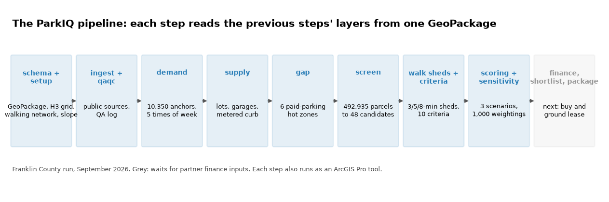
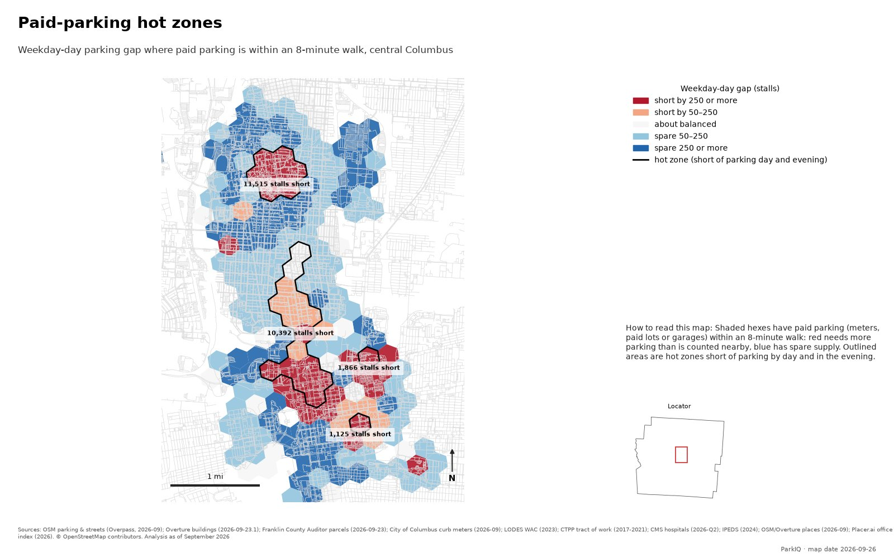

# ParkIQ Location Intelligence Pipeline

ParkIQ: A Parking Lot Site Selection Location Intelligence Analysis

| | | | |
|---|---|---|---|
| Public sources loaded and checked | **{{sources_loaded}}** | Parcels screened | **{{parcels}}** |
| Pipeline steps running | **{{steps_implemented}}** of {{steps_total}} | Demand anchors | **{{anchors}}** |
| Command-line tools | **{{cli_commands}}** | Mapped lots and garages | **{{mapped_facilities}}** |
| ArcGIS Pro tools | **{{toolbox_tools}}** | Paid-parking hot zones | **{{paid_zones}}** |
| Automated test functions | **{{test_functions}}** | Candidate lot sites | **{{candidates}}** |

*Numbers are generated from run `{{run_id}}` and the repository when this report is built; none are typed by hand.*

## The Problem

Finding where a new paid surface parking lot would fill and pay means repeating the same heavy GIS
work for every market: download and clean parcels, zoning, jobs, transit, parking lots and curb
meters; model where people need to park at different times of the week; compare that with the
parking already there; and test every parcel against zoning, size, shape and access rules. Done by
hand in desktop GIS, each county is slow to repeat, the steps drift between analysts, and a change in one
input (a new parcel file, a corrected zoning table) means redoing everything downstream.

## My Approach

I built the analysis as a Python pipeline with an ArcGIS Pro front end:

- **{{steps_implemented}} steps run in order** (schema, setup, ingest, QA, demand, supply, gap, screen,
  walk sheds, criteria, scoring, sensitivity), each reading the previous steps' layers from one
  GeoPackage per run and writing its own, with a report of what it did.
- **Every source has an adapter** that downloads once to a cache, clips to the study area,
  projects to the local state plane, records vintage, licence and row count, and keeps the raw
  delivery beside the cleaned layer. Sources that need a licence stay off and are recorded as
  "not configured"; nothing is ever filled with invented data.
- **Every parameter has a documented source** (scope, verified citation or analyst decision). A
  step refuses to run while a value it needs is still open, and says which.
- **ArcGIS Pro users get a toolbox:** {{toolbox_tools}} tools (check a market, run steps, export
  a file geodatabase, build a report) validate their inputs in Pro and run the same code.

## Technical Highlights

- **Walking-network allocation:** each demand anchor and each lot spreads over the hexagons its
  users can reach in 3, 5 and 8 minutes on foot (Dijkstra on the OpenStreetMap walking network,
  batched with SciPy sparse graphs), and totals are conserved.
- **Resumable, auditable runs:** a step with unchanged inputs is skipped; `--force` reruns it.
  Each run keeps its resolved parameters, source registry, QA log and step reports.
- **Checked outputs:** every layer is validated against the data model on write; the run matches
  its design with {{schema_diff}}; {{qa_checks}} QA checks, {{qa_errors_failed}} error-level
  failures. A file geodatabase export ({{gdb_layers}} layers with domains, subtypes and
  relationship classes) comes from the same run.
- **Quality gates:** a pre-push script runs lint, formatting, strict type checks, text rules and
  {{test_functions}} test functions on a synthetic fixture market; GitHub Actions runs them again.
- **Maps and reports as code:** every map passes an automated map-standard check (title, legend,
  scale, north arrow, sources with vintages); reports like this one are built from Markdown with
  numbers read from the run.

<figure markdown="1">

<figcaption>Figure 1. The pipeline steps and what each produced in the Franklin County run. Grey: the finance steps, waiting for partner inputs.</figcaption>
</figure>

## Results

- The Franklin County run loaded {{sources_loaded}} public sources, modeled {{wd_day_demand}}
  stalls of weekday-daytime parking demand from {{anchors}} demand anchors, counted
  {{mapped_facilities}} mapped lots and garages and {{metered_faces}} metered block faces, and found
  {{paid_zones}} hot zones where paid parking is short.
- Screening all {{parcels}} parcels left {{candidates}} candidate lot sites, ranked under three
  weighting scenarios and tested against 1,000 random weightings.
- The whole chain reruns in one session from the command line or from ArcGIS Pro.

<figure markdown="1">

<figcaption>Figure 2. Paid-parking hot zones in central Columbus: one of the maps the pipeline produces, checked against the map standard.</figcaption>
</figure>

## Limitations and next steps

- Rates and the rate criterion wait for a field rate survey; venues and planned projects are held
  neutral until their data are approved, so rankings can still change.
- Underwriting (buy and ground lease, yield and IRR) waits for the partners' finance assumptions.
- The toolbox runs the command line in a separate Python environment, so ArcGIS Pro and the
  ParkIQ environment must both be installed.

## Data sources

{{sources_table}}

## Why It Matters

A site-selection answer is only as good as the ability to rerun it when an input changes. Built as
a tested pipeline with a Pro toolbox, the analysis reruns end to end, shows where every number came
from, and moves to a new county by adding a market file instead of starting over.

Repository: {{repo_url}} · Portfolio: {{site_url}} · Report generated {{report_date}}
